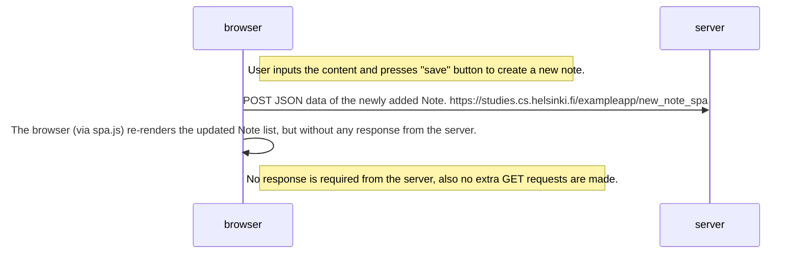

```mermaid
sequenceDiagram
    participant browser
    participant server


     Note right of browser: User inputs the content and presses "save" button to create a new note.
    browser->>server: POST JSON data of the newly added Note. https://studies.cs.helsinki.fi/exampleapp/new_note_spa

    browser->>browser: The browser (via spa.js) re-renders the updated Note list, but without any response from the server.

    Note right of browser: No response is required from the server, also no extra GET requests are made.
```